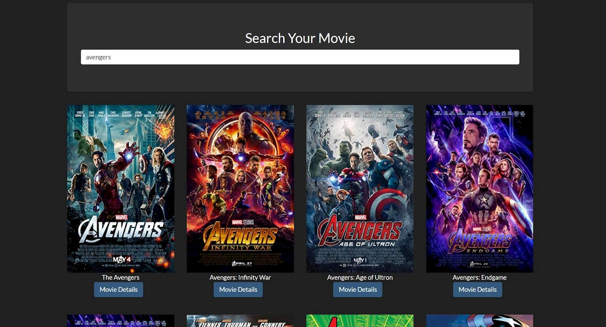

# Movie-Finder

A movie data finder that looks for movies based on the search string input by the user returning a list of movies where 
you can click on a movie to watch its data and acces to the IMDB page of the movie to view aditional information.

Movie data can be accesed and further information abour it can be consulted in imdb.com  

Axios was used to make http request and then using the retrieved JSON data to generate html elements with its information.

Test Change to activate webhooks!
